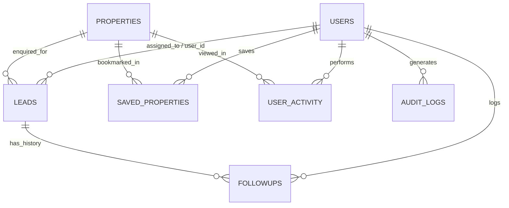

# 🏢 EstateLead — Real Estate Digital Marketing & Secure Lead Generation System

**EstateLead** is an enterprise-grade Real Estate Digital Marketing and Lead Generation Web Application engineered with an **Intermediate Data & Information Security Layer (SecureEstate)**.

The system is focused **100% on-site digital engagement, explainable algorithmic lead scoring, role-based CRM management, and business intelligence analytics**. It does **not** rely on any external advertising platforms, pixels, or third-party trackers (zero Instagram, Facebook, Meta Ads, or Google Ads).

---

## 🌟 Core Feature Modules

### 1. Customer Website & Digital Property Discovery
* **Interactive Hero Search & Filters**: Multi-criteria search across Location (*Chennai, Bangalore, Coimbatore, Hyderabad*), Property Type (*Apartments, Luxury Villas, Penthouses, Plots*), BHK configuration, Purpose (*Buy / Rent*), and Budget slider.
* **Property Showcase & High-Res Galleries**: Complete specifications, built-up area, amenities checklist, and on-site view counters.
* **Interactive Mortgage EMI Estimator**: Mathematical loan estimator calculating monthly installments, principal loan amount, and total interest across customized down payments, tenures, and interest rates.
* **Wishlist Bookmarking**: Instant saved properties shortlisted per authenticated customer.

### 2. Customer Personalization & Tailored Recommendation Engine
* **Weighted Matching Algorithm**: Calculates property match percentage (0–100%) based on Location (+40%), Property Type (+35%), and Budget alignment (+25%).
* **Browsing History Tracking**: Automatically logs inspected properties in `user_activity` and presents browsing history on the customer dashboard.
* **Real-Time Criteria Editor**: Customers can adjust their search preferences with immediate match re-computation.
* **Enquiry Status Progression**: Real-time visual pipeline tracker (*New $\rightarrow$ Contacted $\rightarrow$ Site Visit $\rightarrow$ Negotiation $\rightarrow$ Converted*).

### 3. Multi-Channel Lead Generation & Algorithmic Scoring Engine
* **On-Site Lead Capture Mechanisms**:
  * Direct Property Enquiry forms.
  * Dedicated On-Site Tour Scheduler (with date & time slot selection).
  * 1-Click Instant 30-Minute Callback requests.
  * Gated Project Brochure Downloads.
  * Homepage Real Estate Consultation forms.
* **Explainable Algorithmic Scoring Engine (0–100)**:
  * Intent & Enquiry Commitment (up to 25 pts)
  * Purchase Timeline / Urgency (up to 25 pts)
  * Budget Tier & Ticket Size (up to 25 pts)
  * Contact Data Completeness & Verification (up to 15 pts)
  * Platform Behavioral Engagement (up to 10 pts)
* **Lead Categorization**:
  * 🔥 **HOT Lead** (Score $\ge 75$): Priority callback within 30 minutes.
  * ⚡ **WARM Lead** (Score $50 - 74$): Standard 24-hour consultant follow-up.
  * ❄️ **COLD Lead** (Score $< 50$): Long-term nurturing pipeline.
* **Explainable Rationale**: Every captured lead stores an itemized scoring breakdown string explaining exact points awarded.

### 4. Admin & Agent Lead Management CRM
* **Centralized Pipeline Table**: Multi-faceted filtering by Category (*HOT/WARM/COLD*), Status (*New, Contacted, Site Visit, Negotiation, Converted, Lost*), Assigned Consultant, and Keyword Search.
* **Slide-Over Lead Detail Drawer**: Complete profile view, explainable score breakdown, status dropdown, and agent assignment.
* **Dynamic Follow-Up System**: Log phone calls, site tours, SMS, and negotiations with reminder dates; chronological interaction timeline per lead.
* **CSV Export**: Export filtered lead lists with automated security audit logging.

### 5. Analytics & Business Intelligence Dashboard
* **6-Stage Conversion Funnel**: Impressions / Views $\rightarrow$ Captured Enquiries $\rightarrow$ Contacted $\rightarrow$ Site Visits $\rightarrow$ Negotiations $\rightarrow$ Converted Deals, with stage-by-stage drop-off percentages.
* **Executive Financial KPIs**: Active Pipeline Deal Valuation (in ₹ Crores), Closed Sales Revenue, Total Leads, and Overall Conversion Rate.
* **Inventory Leaderboard**: Properties ranked by generated leads, views, and lead-to-view ratios.
* **Demand Demographics**: Demand charts across target cities, property categories, purchase urgency, and capture channels.
* **Consultant Leaderboard**: Workload distribution, site visits conducted, follow-ups logged, and conversion rates.

---

## 🔒 SecureEstate Intermediate Security Layer

EstateLead implements an intermediate security architecture:

1. **Role-Based Access Control (RBAC)**: Strict separation of privileges across `customer`, `agent`, and `admin` roles. Customer accounts attempting to reach CRM or Analytics APIs receive `403 Forbidden` and trigger automated security events.
2. **Bcrypt Password Hashing & Policy**: Enforces salted bcrypt hashes (work factor 10) and minimum password complexity (8+ characters, digits, and special symbols).
3. **PII Data Masking**: Masks phone numbers (`98401*****`) and emails (`p***@example.com`) for unauthorized agents viewing unassigned leads.
4. **Brute-Force Protection**: 5-attempt threshold triggers a 15-minute account lockout and security event log.
5. **Anti-Spam Rate Limiting**: Express rate limiters applied to authentication (`authLimiter`), lead submission forms (`enquiryLimiter`), and general REST APIs (`apiLimiter`).
6. **Input Sanitization & XSS Neutralization**: Strips and escapes HTML tags and script injections on all incoming payloads.
7. **Parameterized Queries**: Universal database adapter protecting against SQL injection vulnerabilities across SQLite and PostgreSQL.
8. **Tamper-Proof Audit Logging**: Every critical action (*login, lead capture, preference updates, status changes, assignments, follow-ups, CSV exports*) is permanently recorded in `audit_logs`.

---

## 🗄️ Database Architecture (9 Tables)



1. **`users`**: User profiles, password hashes, roles (`customer`, `agent`, `admin`), search preferences, account lock status.
2. **`properties`**: Property inventory (title, location, BHK, price, area, amenities, images, views count, saves count).
3. **`leads`**: Captured prospect enquiries, timeline, lead scores (0-100), categories (HOT/WARM/COLD), score reasons, pipeline status, assigned agent.
4. **`saved_properties`**: Customer wishlist bookmarks.
5. **`user_activity`**: Granular behavioral activity logs (view property, submit enquiry, update criteria).
6. **`followups`**: Agent interaction logs, scheduled dates, interaction types, and status.
7. **`audit_logs`**: Tamper-proof audit trails with user, action, entity, result, and IP address.
8. **`security_events`**: High-priority security alerts (brute-force lockouts, unauthorized RBAC attempts).
9. **`system_settings`**: Global platform configurations.

---

## 🚀 Quick Start & Installation Guide

### Prerequisites
* **Node.js**: v18.0.0 or higher
* **npm**: v9.0.0 or higher

### 1. Install Dependencies
```bash
npm install
```

### 2. Initialize Database & Seed Demo Data
```bash
npm run seed
```

### 3. Run Automated Full-Stack Test Suite (48/48 Tests)
```bash
npm test
```

### 4. Start the Application Server
```bash
npm start
```
The server will start at **`http://localhost:5000`**.

---

## 👥 Administrator Credentials

| Role | Name | Email Address | Mobile / Password | Permissions |
| :--- | :--- | :--- | :--- | :--- |
| **Administrator** | Ramya | `953624244046@ritrjpm.ac.in` | `7418738393` / `Admin@123` | Full System Access, CRM, Analytics, User Management, Audit Logs |
| **Administrator** | Rohini | `953624244048@ritrjpm.ac.in` | `9789165375` / `Admin@123` | Full System Access, CRM, Analytics, User Management, Audit Logs |

*Note: New customers and buyers can create accounts freely through the [Register Account](http://localhost:5000/register.html) portal on the website.*

---

## 🌐 Application Navigation Sitemap

* **Homepage**: [`http://localhost:5000/`](http://localhost:5000/)
* **Property Listings Catalog**: [`http://localhost:5000/properties.html`](http://localhost:5000/properties.html)
* **Property Details & EMI Calculator**: [`http://localhost:5000/property-details.html?id=1`](http://localhost:5000/property-details.html?id=1)
* **Customer Dashboard**: [`http://localhost:5000/dashboard.html`](http://localhost:5000/dashboard.html)
* **Saved Wishlist**: [`http://localhost:5000/saved.html`](http://localhost:5000/saved.html)
* **Lead Management CRM**: [`http://localhost:5000/crm.html`](http://localhost:5000/crm.html)
* **Analytics & BI Dashboard**: [`http://localhost:5000/analytics.html`](http://localhost:5000/analytics.html)
* **Sign In Portal**: [`http://localhost:5000/login.html`](http://localhost:5000/login.html)
* **Register Account**: [`http://localhost:5000/register.html`](http://localhost:5000/register.html)
